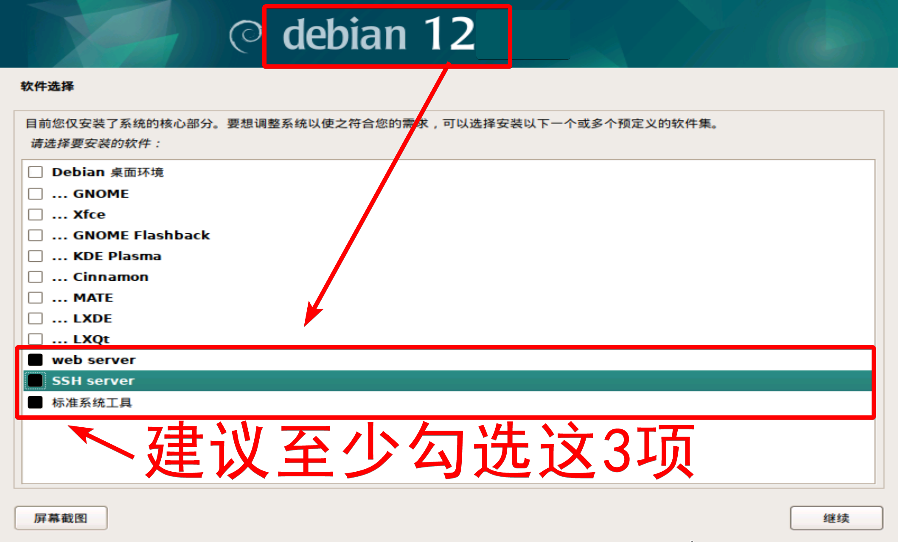
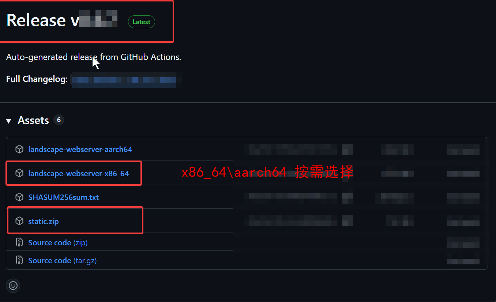
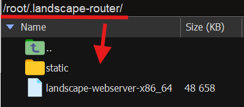
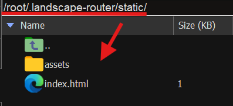
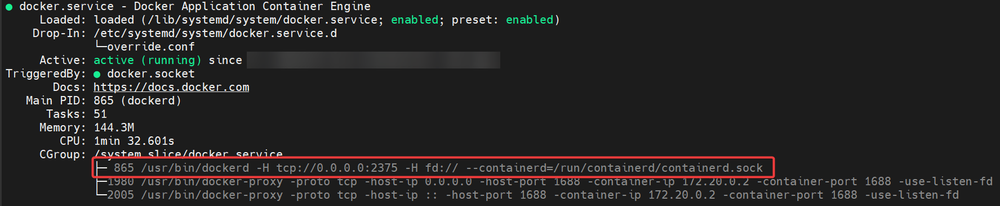
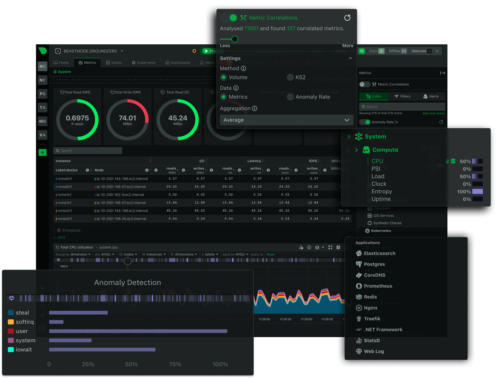
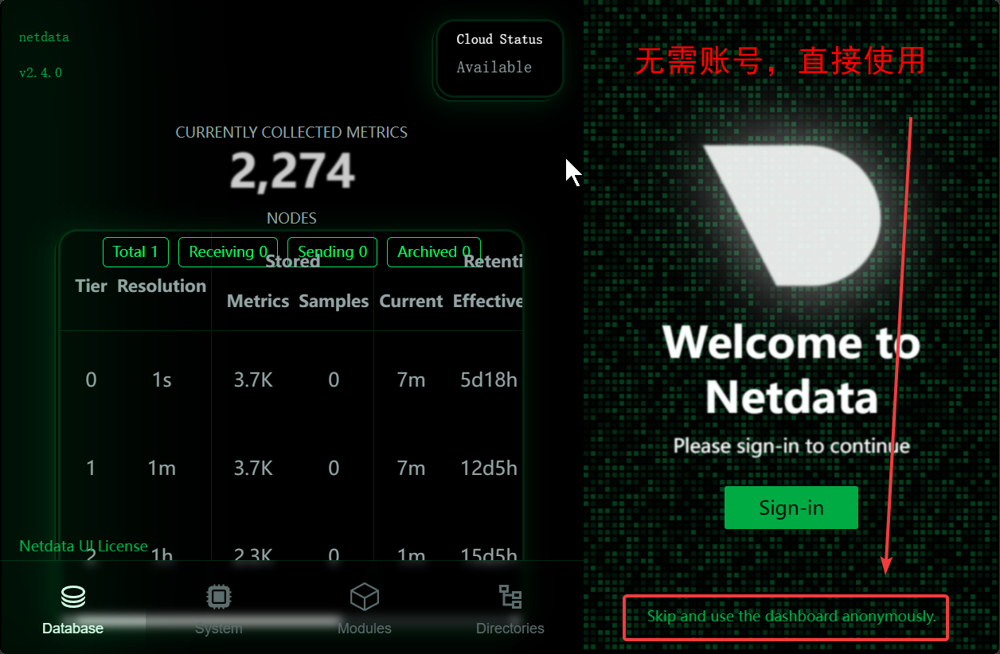

# 在debian里，玩转Landscape和其他花活（持续更新中...）

**本文可自由转载，无需标注出处**  
[Landscape 文档网站](https://landscape.whileaway.dev/introduction.html) | [Landscape github](https://github.com/ThisSeanZhang/landscape)

**debian用户：root，非 root 用户请自行添加 sudo**    

## 安装过程并不复杂，复制命令粘贴到SSH终端执行即可

## 核心特性
* 分流控制（SIP、QoS(dscp)、DIP、域名、Geo 匹配规则）
* eBPF 路由
* 每个流 Flow 独立 dns 配置以及缓存（避免 dns 污染、泄露）
* 流量导入 Docker 容器
* Geo 管理

## 内核版本兼容的 常见 Linux 发行版  
✅ 内核版本兼容  
🟢 部分版本的内核版本兼容  
❌ 内核版本不兼容  
**需要 GNU libc（GLIBC）标准库才能运行，内核版本6.9+才能使用全部功能（6.6可能也可以，未明确）**


| 发行版 | 兼容 | 版本要求 | 备注 |  
|---|---|---|---|  
| Debian  | ✅ | 13+ | 低版本需更新内核至6.9+ |  
| Ubuntu | ✅ | 25.04+ | 低版本需更新内核至6.9+|  
| PVE | ✅ | 9+ | 低版本需更新内核至6.9+|  
| OMV | ✅ | 8+ | 低版本需更新内核至6.9+| 
| Armbian | 🟢 |  | 需内核版本6.9+|  
| FnOS | ❌ |  | 内核限制 |  
| OpenWRT | ❌ |  | 非GLIBC无法兼容 |  
| Alpine | ❌ |  | 非GLIBC无法兼容 |  
<!--⚠️ 调整后可兼容-->
<!--🟡 未知  -->
``` shell
# 查看内核版本
uname -r

```
``` shell
# 输出带有 GLIBC 或 GNU libc 支持，带有 musl libc 则不支持
ldd --version

```
# 目录
- [debian 安装配置](#debian-安装配置)
  - [下载 debian  ISO 镜像](#下载必要软件)
  - [安装 debian](#安装-debian)
  - [时区修改到上海](#时区修改到上海)
  - [允许root用户使用密码登录ssh](#允许root用户使用密码登录ssh)
  - [关闭 swap](#关闭-swap)
  - [修改软件源（可选）](#修改软件源可选)
  - [升级内核，到 6.9以上（debian 13 无需升级内核）](#升级内核到-69以上debian-13-无需升级内核)
- [docker、docker compose 安装（可选）](#dockerdocker-compose-安装可选)
- [landscape 安装](#landscape-安装)
  - [安装 pppd](#安装-pppd)
  - [创建 landscape systemd 服务文件](#创建-landscape-systemd-服务文件)
  - [下载并上传 landscape-router](#下载并上传-landscape-router)
  - [修改网卡配置](#修改网卡配置)
  - [关闭本机 DNS 服务](#关闭本机-dns-服务)
  - [重启网络，并启动 landscape-router](#重启网络并启动-landscape-router)
  - [登录 landscape 账号 root 密码 root，https://192.168.22.1:6443](#登录-landscape-账号-root-密码-roothttps1921682216443)
  - [至此可以在 landscape-router web 中进行配置](#至此可以在-landscape-router-web-中进行配置)
  - [应用 Landscape-Router 开机启动](#应用-landscape-router-开机启动)
  - [修改apache80端口到8080, 以免后续与其他反代软件冲突](#修改apache80端口到8080-以免后续与其他反代软件冲突)
  - [如何升级 landscape](#如何升级-landscape)
  - [在显示器/终端中 启动/关闭 landscape-router](#在显示器终端中-启动关闭-landscape-router)
- [Landscape 实战案例](#landscape-实战案例)
  - [域名/IP 分流实践](#域名ip-分流实践)
  - [基于 vlan/ssid（WiFi） 的分流实现（暂不能实现）](#基于-vlanssidwifi-的分流实现暂不能实现)
- [用 dpanel 部署 dockercompose](#用-dpanel-部署-dockercompose)
  - [使用 dpanel 的必要性](#使用-dpanel-的必要性)
  - [dpanel标准版 与 dpanel lite](#dpanel标准版-与-dpanel-lite)
  - [安装 dpanel](#安装-dpanel)
  - [在其他机器上使用 dpanel管理本机docker](#在其他机器上使用-dpanel管理本机docker)
- [Docker容器作为分流出口（接应容器部署）](#docker容器作为分流出口接应容器部署)
  - [接应容器概述](#接应容器概述)
  - [创建 worker_program 工作程序 启动脚本](#创建-worker_program-工作程序-启动脚本)
  - [Docker 部署 单个 接应容器](#docker-部署-单个-接应容器)
  - [Compose 部署 多个 接应容器](#compose-部署-多个-接应容器)
- [常见网络应用、compose 安装](#常见网络应用compose-安装)
  - [filebrowser（文件管理）](#filebrowser文件管理)
  - [tabby （网页ssh）](#tabby-网页ssh)
  - [ArozOS NAS 网页桌面操作系统](#arozos-nas-网页桌面操作系统)
  - [集客AC dockercompose](#集客ac-dockercompose)
  - [ddns-go dockercompose](#ddns-go-dockercompose)
  - [FRP 客户端（FRPC）](#frp-客户端frpc)
  - [FakeSIP、FakeHTTP](#fakesipfakehttp)
  - [netdata（性能、网络监控面板/仪表盘）](#netdata性能网络监控面板仪表盘)

# debian 安装配置

## 下载必要软件
SSH工具 (安装一个即可)：[MobaXterm（仅有win版本）](https://mobaxterm.mobatek.net/download.html) | [Tabby](https://github.com/Eugeny/tabby/releases/tag/v1.0.224)  
安装U盘制作工具（安装一个即可）: [balena etcher](https://etcher.balena.io/) | [Ventoy](https://www.ventoy.net/cn/download.html)   

以下三种系统，选一个即可，建议 Debian 13   
Debian 12 iso 安装镜像: [官方下载](https://www.debian.org/releases/bookworm/) | [兰州大学镜像](http://mirror.lzu.edu.cn/debian-cd/) | [163镜像](http://mirrors.163.com/debian-cd/)    
Debian 13 iso 安装镜像: [官方下载](https://www.debian.org/releases/) | [兰州大学镜像](http://mirror.lzu.edu.cn/debian-cd/) | [163镜像](http://mirrors.163.com/debian-cd/)   
PVE 9: [官方下载](https://www.proxmox.com/en/downloads)    

## 安装 debian

**debian用户：root，非 root 用户请自行添加 sudo**   
### 注意❗：   
**1、语言选择 us/english，避免中文路径与某些软件不兼容,（debian12后面再调整时区到上海）。**   
**2、时区选择上海 Asia/Shanghai**  
**3、❗❗❗启用网络镜像站点，选择 中国  ❗❗❗**    
**4、仅需 安装 webserver 、sshserver、标准配置，3个选项勾选即可**    
[详细安装过程参考，建议在安装过程中选择 ❗❗❗**中国网络镜像站点**❗❗❗](https://246859.github.io/posts/code/linux/debian12_install.html)        

   
## 时区修改到上海   
**debian用户：root，非 root 用户请自行添加 sudo**   
**debian13 安装过程中配置时区后，无需重复配置时区**    
```shell
# 设置时区为上海
timedatectl set-timezone Asia/Shanghai
 # 验证配置是否生效
timedatectl

```
   
## 允许root用户使用密码登录ssh    
**debian用户：root，非 root 用户请自行添加 sudo**   
```shell
echo "PermitRootLogin yes" >>/etc/ssh/sshd_config

# 重启 ssh   
systemctl restart ssh

```

## 关闭 swap
Swap 是内存的"应急备份"，用磁盘空间换取系统稳定性，但过度依赖会拖慢速度。合理配置可平衡性能与安全。
### nano 用法简述
编辑结束后，先 `` ctrl + s `` 保存，再 `` ctrl + x `` 退出。

### 注释或删除 Swap 挂载项
```shell
nano /etc/fstab

```
找到包含 swap 的行（通常类似 /swapfile 或 /dev/mapper/...-swap），在行首添加 # 注释掉，例如：
```diff
- /swapfile none swap sw 0 0
+ #/swapfile none swap sw 0 0
```
**编辑结束后，先 `` ctrl + s `` 保存，再 `` ctrl + x `` 退出。**  
### 禁用 systemd 管理的 Swap 单元（若有/非必须）
```shell
# 检查激活的 Swap 单元
systemctl --type swap

# 禁用所有 Swap 单元（替换 UNIT_NAME 为实际名称）
systemctl mask UNIT_NAME.swap

```
## 修改软件源（可选）
**安装时网络镜像站点已选择中国源，可跳过换源**  
```shell
# 若软件源非为国内源，可以考虑修改软件源为国内源，例如ustc源
# 备份源
cp /etc/apt/sources.list /etc/apt/sources.list.bak

```
**debian12源 适用于debian12**
```shell
# ustc源 适用于debian12
cat <<EOF > /etc/apt/sources.list
deb https://mirrors.ustc.edu.cn/debian/ bookworm main contrib non-free non-free-firmware
deb-src https://mirrors.ustc.edu.cn/debian/ bookworm main contrib non-free non-free-firmware

deb https://mirrors.ustc.edu.cn/debian/ bookworm-updates main contrib non-free non-free-firmware
deb-src https://mirrors.ustc.edu.cn/debian/ bookworm-updates main contrib non-free non-free-firmware

deb https://mirrors.ustc.edu.cn/debian/ bookworm-backports main contrib non-free non-free-firmware
deb-src https://mirrors.ustc.edu.cn/debian/ bookworm-backports main contrib non-free non-free-firmware

deb https://mirrors.ustc.edu.cn/debian-security/ bookworm-security main contrib non-free non-free-firmware
deb-src https://mirrors.ustc.edu.cn/debian-security/ bookworm-security main contrib non-free non-free-firmware
EOF
```

**debian13源 适用于debian13**
```shell
# ustc源 适用于debian13
cat <<EOF > /etc/apt/sources.list
deb https://mirrors.ustc.edu.cn/debian/ trixie main contrib non-free non-free-firmware
deb https://mirrors.ustc.edu.cn/debian/ trixie-updates main contrib non-free non-free-firmware
deb https://mirrors.ustc.edu.cn/debian/ trixie-backports main contrib non-free non-free-firmware
deb https://mirrors.ustc.edu.cn/debian-security/ trixie-security main contrib non-free non-free-firmware
EOF
```

## 升级内核，到 6.9以上（debian 13 无需升级内核）   

``` shell
# 查看内核版本，大于6.9则无需升级内核
uname -r

```

```shell
apt update
apt search linux-image-6.12

```

```shell
# 安装内核镜像及头文件（指定 Backports 源）
apt install -t bookworm-backports \
    linux-image-6.12.30+bpo-amd64 \
    linux-headers-6.12.30+bpo-amd64

# 安装失败就问AI，6.9以上即可。   

# 更新 GRUB 引导配置
update-grub

# 重启系统生效
reboot

```
# docker、docker compose 安装（可选）

注释掉原有所有行，换掉下面的源。如已选择合适的源则可跳过。   
```shell
# 安装curl   
apt update
apt install curl -y
curl --version

```
   
```shell
# 三种方式，选择一种(已包含dockercompose)
# 使用官方源安装（国内直接访问较慢）
curl -fsSL https://get.docker.com | bash
# 使用阿里源安装
curl -fsSL https://get.docker.com | bash -s docker --mirror Aliyun
# 使用中国区 Azure 源安装
curl -fsSL https://get.docker.com | bash -s docker --mirror AzureChinaCloud
```
返回docker版本信息即为成功   
   
# landscape 安装

## 安装 pppd
```shell
# 用于 pppoe 拨号
apt install ppp -y
pppd -version

```

## 创建 landscape systemd 服务文件   

```shell
nano /etc/systemd/system/landscape-router.service

```

```shell
[Unit]
Description=Landscape Router

[Service]
ExecStart=/root/.landscape-router/landscape-webserver-x86_64
# 注意这个路径与下面创建的landscape-router目录相同。
Restart=always
User=root
LimitMEMLOCK=infinity

[Install]
WantedBy=multi-user.target
```
**编辑结束后，先 `` ctrl + s `` 保存，再 `` ctrl + x `` 退出。**   

## 下载并上传 landscape-router  
```shell
# 创建landscape-router目录。   
cd /root
mkdir /root/.landscape-router
cd /root/.landscape-router

```
[下载 landscape-webserver-x86_64、static.zip 文件](https://github.com/ThisSeanZhang/landscape/releases/)   
       
放到下面创建的目录。（注意 static 可能存在嵌套，需要调整，参考下图）   
   
   

```shell
# 上传文件后，赋权
chmod -R 755 /root/.landscape-router

```
## 修改网卡配置   

将 LAN 网卡全设置为 manual 后, 暂时无法通过lan访问这个dabian。需要至少一个网卡拥有静态IP，以访问 landscape webui。  
有2种方式：  
1、（不推荐）将一个lan网卡设为 static 其他网卡设备配置为 manual，之后可在web中可将这张网卡加入网桥，但需配置为manual。   
2、（推荐）对于pppoe用户，将 WAN 的网卡额外在配置文件中设置一个静态 IP, pppoe 拨号会自动生成一个虚拟网卡，与该配置不冲突。   
建议采用方式2，即使路由程序出现故障时, 可将电脑/手机设置为静态IP，访问landscape ui。 例如 wan 设置为 192.168.22.1/24时，另一台电脑/手机将IP设为192.168.22.2 ~ 192.168.22.255之一，连接wan口后，即可访问 landscape ui 。   
```shell
# 获取网卡名
ip a

```

```shell
nano /etc/network/interfaces

```
```shell
# pppoe 后生成一个pppoe网卡，与此网卡不冲突
# 假定 1 网卡用于 WAN 网卡
auto <第 1 张网卡名> 
iface <第 1 张网卡名> inet static
    address 192.168.22.1
    netmask 255.255.255.0

# 后续可在 Landscape UI 中创建 Land 网桥
# 假定 2~3 网卡用于 LAN 网卡
auto <第 2 张网卡名>
iface <第 2 张网卡名> inet manual

auto <第 3 张网卡名>
iface <第 3 张网卡名> inet manual
```
**编辑结束后，先 `` ctrl + s `` 保存，再 `` ctrl + x `` 退出。**   

## 关闭本机 DNS 服务   

```shell
systemctl stop systemd-resolved
systemctl disable systemd-resolved
systemctl mask systemd-resolved

```
## 重启网络，并启动 landscape-router    

```shell
# 重启网络，并启动 landscape-router
systemctl restart networking && systemctl start landscape-router.service
```
通过端口，检查 landsape 是否成功启动，检查 6443 、 6300 端口是否为landscape   
```shell
ss -tulnp | grep -E ':6300|:6443'

```

   
## 登录 landscape 账号 root 密码 root，通过wan网卡静态IP访问，https://192.168.22.1:6443   

## 应用 Landscape-Router 开机启动   

```shell
# 配置无误后，应用landscape-router 开机启动
systemctl enable landscape-router.service

```

## 至此可以在 landscape-router web 中进行配置   

**[详细设置参考官方文档](https://landscape.whileaway.dev/feature/flow.html)**


## 修改apache80端口到8080, 以免后续与其他反代软件冲突   

```shell
nano /etc/apache2/ports.conf

```
   
listen 由 80 改到 8080  
**编辑结束后，先 `` ctrl + s `` 保存，再 `` ctrl + x `` 退出。**      

```shell
systemctl restart apache2

```


   
## 如何升级 landscape   ？
[下载 landscape-webserver-x86_64、static.zip 文件](https://github.com/ThisSeanZhang/landscape/releases/)   
       


```shell
# 关闭服务
systemctl stop landscape-router.service

```
放到下面创建的目录。（注意 static 可能存在嵌套，需要调整，参考下图）   
   
   
替换 staic目录（解压、注意嵌套目录）   
替换 landscape文件，并赋权   
```shell
# 启动服务，建议重启系统，避免出现奇奇怪怪的问题
systemctl start landscape-router.service

```
   
## 在显示器/终端中 启动/关闭 landscape-router   

需要对landscape 先赋予执行权限   
```shell
# 启动服务
systemctl start landscape-router.service
# 重启服务
systemctl restart landscape-router.service
# 停止服务
systemctl stop landscape-router.service
# 启用 开机启动服务 ( 确认没有问题之后执行 )
systemctl enable landscape-router.service
# 禁用 开机启动服务 ( 确认没有问题之后执行 )
systemctl disable landscape-router.service
```
# Landscape 实战案例

## [详细设置参考官方文档](https://landscape.whileaway.dev/feature/flow.html)

## 域名/IP 分流实践   

* 只会匹配中一条规则，匹配中即发送至出口，后续规则不再匹配 
* 以下是一种推荐分流布局，以域名分流为主，没有域名的连接由IP规则补充   
* 可使用 Geo 文件辅助分流   
* 域名初次访问时，域名分流 优先级 会影响 域名初次访问查询速度，越靠前匹配中，越快被查询
* 域名再次访问时，域名被解析后，基于 IP map，时间复杂度为 O(1)，再次访问的域名之匹配时间 = IP匹配时间 = O(1) 

| 优先级序号 | 用途 | 类别 |
|---|---|---|
| 1~999  | 局域网设备 域名重定向 | 域名分流|
| 1000 | 速查域名的 GeoSite 集合 | 域名分流 |
| 1001~2000 | （少量）域名/网站集合  | 域名分流|
| 2001~2999 | （大量）地区/ISP 集合   | 域名分流|
| 3000 | 整个 GeoSite 集合（GeoSite 兜底）  | 域名分流 |
| 10000 | 空规则 仅配置 dns 服务器（域名规则兜底） | dns 服务器配置（必须❗）|
|---|---|---|
| 11000~12000 | （少量）特定 IP 集合  | IP 分流 |
| 12000~13000 | （大量）地区/ISP 集合  | IP 分流 |        
| 20000 | 0.0.0.0/0 兜底 IP 规则 | IP 分流 |


## 基于 vlan/ssid（WiFi） 的分流实现（暂不能实现）
### 概述
* 在 SSH 中，创建多个 vlan 网卡，设为 manual
* flow 入口 设置为规则设置为 vlan
* 在 AC 中配置 ssid vlan
### landscape 中配置
```bash
# 检查网卡 
ip a

```


```bash
# 添加 vlan 网卡
nano /etc/network/interfaces

```

```bash
auto eth0
iface eth0 inet manual

# 创建 vlan id 为 10 的网卡，绑定到 物理接口 eth0
auto eth0.10
iface eth0.10 inet manual
    vlan-raw-device eth0       # 绑定物理接口

# 创建 vlan id 为 20 的网卡，绑定到 物理接口 eth0
auto eth0.20
iface eth0.20 inet manual
    vlan-raw-device eth0       # 绑定物理接口

```
**编辑结束后，先 `` ctrl + s `` 保存，再 `` ctrl + x `` 退出。**   

* 在landscape webui 中，配置为lan，开启dhcp
* `分流设置`中添加新的流，配置入口规则为 vlan 所设置 子网

### AC 中配置

为 ssid 添加 vlan 10、20   
[在 ikuai AC 中为 ssid 添加 vlan，参考官方文档 1、2 两节，dhcp已在landscape中配置无需在ikuai中配置 ](https://www.ikuai8.com/support/cjwt/ap/ap-ssid-vlan.html)

# 用 dpanel 部署 dockercompose

## 使用 dpanel 的必要性
dpanel 集成 dockercompose 应用商店，便于一键部署容器应用。    
[dpanel 文档](https://dpanel.cc/#/zh-cn/install/docker) |
[dpanel 演示站/demo](https://dpanel.park1991.com/dpanel/ui/user/login)
##  dpanel标准版 与 dpanel lite 

标准版本中提供了域名绑定及证书功能，需要绑定 80 及 443 端口。Lite版与标准版只有镜像地址区别，除不再需要映射 80 及 443 端口外，其余配置均一致。  
个人推荐 lite 版，标准版额外功能网页相对简陋，何不traefik？如需更丰富的配置可使用 [Nginx UI](https://nginxui.com/zh_CN/guide/about.html)、[Nginx Proxy Manager](https://nginxproxymanager.com/)、[OpenResty Manager](https://om.uusec.com/cn/) 等项目。

## 安装 dpanel

[参看官方文档，三种方式任选一种（一键安装、docker、compose）](https://dpanel.cc/#/zh-cn/install/docker) 

## 在其他机器上使用 dpanel管理本机docker

### 创建docker tcp    

```shell
systemctl edit docker

```
添加下面几行  
```shell
[Service]
ExecStart=
ExecStart=/usr/bin/dockerd -H tcp://0.0.0.0:2375 -H fd:// --containerd=/run/containerd/containerd.sock
```
```shell
# 重启docker服务，需等待数十秒   
systemctl daemon-reload && systemctl restart docker
# 验证是否生效，输出有红框内容为正常
systemctl status docker

```


    
### docker tcp 开启 TLS加密(略)

[DPanel 可视化 Docker 管理面板](https://dpanel.cc/#/zh-cn/manual/system/remote?id=%e4%bd%bf%e7%94%a8-https-%ef%bc%88%e5%bc%80%e5%90%af-tls-%ef%bc%89)    


# Docker容器作为分流出口（接应容器部署）

## 接应容器概述  

* 仅搭配 [**接应程序**](https://github.com/ThisSeanZhang/landscape/blob/main/landscape-ebpf/src/bin/redirect_pkg_handler.rs) 进行打包的容器，可作为有效的流 **出口容器**  
* 可挂载任意程序在 `/app/server` 目录下作为 **工作程序**, 需要自行编写 `/app/server/run.sh` 脚本用于启动
* **工作程序** 需监听 `12345` 端口作为 tproxy 入口, 其他端口需要通过环境变量 `LAND_PROXY_SERVER_PORT` 修改 **接应程序** 默认监听端口
* **接应程序** 会将待处理流量转发到 **工作程序** 的 tproxy 入口 
* landscape 0.6.7+ 版本容器出口默认为 Flow 0 出口  

## 接应程序配置
默认设置下， 容器有一个[**演示工作程序** ](https://github.com/ThisSeanZhang/landscape/blob/main/landscape-ebpf/src/bin/redirect_demo_server.rs) 放置在 `/app/server` 监听 `12345` 端口作为tproxy入口。

而 **接应程序** 是放置在 `/app`， 默认情况下是会将待处理流量转发到，演示 **工作程序** 监听端口 `12345`的tproxy入口。 可以通过设置容器的环境变量改变监听端口: `LAND_PROXY_SERVER_PORT`。

可将需要的 **工作程序** 挂载在 `/app/server` 目录下以替换 **演示工作程序**，将 **工作程序** 启动脚本挂载为 `/app/server/run.sh` ， `/app/start.sh` 默认会去执行`/app/server/run.sh`以启动 **工作程序** 或 **演示工作程序** 。


## 创建 worker_program 工作程序 启动脚本
**worker_program 可替换为任意 工作程序**
```shell
# 在 debina worker_program 目录中创建 worker_program 工作程序启动脚本
nano /home/worker_program/run.sh

```
```bash
#!/bin/bash

# 设置资源限制（也可在compose限制，不了解者可跳过这里）
# ulimit -n 1000000
# ulimit -u 500
# echo "设置资源限制成功"

# 启动审计程序守护进程
while true; do
    echo "启动 worker_program 工作程序..."
    /app/server/worker_program -d /app/server/config
	# 前一个为 worker_program 工作程序 二进制文件 后一个为 worker_program 工作程序 配置文件目录
    echo "worker_program 工作程序 异常退出，等待1秒后重新重启..."
    sleep 1
    # 下面检查 worker_program 工作程序 是否正常退出（可选，但推荐）
    if [[ $? -ne 0 ]]; then
        echo "worker_program 工作程序 进程异常退出，检查日志..."
        # 在这里添加日志检查或其他错误处理
        sleep 5
    fi
done
```
**编辑结束后，先 `` ctrl + s `` 保存，再 `` ctrl + x `` 退出。**  

## Docker 启用 ipv6
**启用ipv6教程无误，但landsape暂无支持，需配置iptable才能生效，等待官方支持。**
**仅容器出口 无法连接ipv6网络，不影响ipv6流量分流到容器**
```shell
# 创建 配置文件，这个文件是
cat <<EOF > /etc/docker/daemon.json
{
  "ipv6": true,
  "fixed-cidr-v6": "fd00::/80"  
}
EOF

```
`fixed-cidr-v6` 需要填入正确的前缀   
使用 Docker 默认 ULA 范围，则需要开启 nat6 ，**此处教程待补充**   

```shell
# 重启docker，需等待数十秒
systemctl daemon-reload && systemctl restart docker
systemctl restart landscape-router.service

```
## Docker 部署 单个 接应容器

**worker_program 可替换为任意 工作程序**

```shell
docker run -d \
  --name worker_program-1 \
  --sysctl net.ipv4.conf.lo.accept_local=1 \
  --cap-add=NET_ADMIN \
  --cap-add=BPF \
  --cap-add=PERFMON \
  --privileged \
  -p 外部端口:内部端口 \
  -v /root/.landscape-router/unix_link/:/ld_unix_link/:ro \ # 必要映射
  -v /home/worker_program/worker_program-1/run.sh:/app/server/run.sh \ # 修改左边挂载审计程序1启动脚本
  -v /home/worker_program/worker_program-1/config:/app/server/config \ # 修改左边挂载审计程序1配置文件
  -v /home/worker_program/worker_program-1/worker_program:/app/server/worker_program \ # 修改左边挂载审计程序1二进制文件
  ghcr.io/thisseanzhang/landscape-edge:amd64-xx # 需修改容器标签

```

## Compose 部署 多个 接应容器

**worker_program 可替换为任意 工作程序**  
**[enable_ipv6: true 时，docker配置中必须启用ipv6，否则会报错](#docker-启用-ipv6)**  
```yaml
networks:
  worker_program-br:
    driver: bridge
    enable_ipv6: true # 开启ipv6，容器自动获取ivp6配置（启用此项，docker配置中必须启用ipv6，否则会报错 /etc/docker/daemon.json）
    ipam:
      config:
        - subnet: 172.100.0.0/16
          gateway: 172.100.0.254
services:
  service-1:
    image: ghcr.io/thisseanzhang/landscape-edge:amd64-xx # 需修改容器标签
    sysctls:
      - net.ipv4.conf.lo.accept_local=1
    cap_add:
      - NET_ADMIN
      - BPF
      - PERFMON
    privileged: true
    restart: unless-stopped
    logging:
      options:
        max-size: "10m"
    deploy:
      resources:
        limits:
          cpus: '4.0'
          memory: 512M
    # 为启用 ports 配置时，使用容器ip:端口 即可在主机内访问容器web界面，主机外访问时需使用反代 或 端口映射到主机端口
    #ports: # 可选配置  # 静态映射，主要用于映射web端口
    #  - "0.0.0.0:外部端口号:内部端口号"        # 映射到主机v4端口
    #  - "[::]:外部端口号:内部端口号"        # 映射到主机v6端口
    networks:
      worker_program-br:
        ipv4_address: 172.100.0.1
    volumes:
      - /root/.landscape-router/unix_link/:/ld_unix_link/:ro # 必要映射
      - /home/worker_program/worker_program-1/run.sh:/app/server/run.sh # 挂载审计程序1启动脚本
      - /home/worker_program/worker_program-1/config:/app/server/config # 挂载审计程序1配置文件
      - /home/worker_program/worker_program-1/worker_program:/app/server/worker_program # 挂载审计程序1二进制文件
  service-2:
    image: ghcr.io/thisseanzhang/landscape-edge:amd64-xx # 需修改容器标签
    sysctls:
      - net.ipv4.conf.lo.accept_local=1
    cap_add:
      - NET_ADMIN
      - BPF
      - PERFMON
    privileged: true
    restart: unless-stopped
    logging:
      options:
        max-size: "10m"
    deploy:
      resources:
        limits:
          cpus: '4.0'
          memory: 512M
    networks:
      worker_program-br:
        ipv4_address: 172.100.0.2
    volumes:
      - /root/.landscape-router/unix_link/:/ld_unix_link/:ro # 必要映射
      - /home/worker_program/worker_program-2/run.sh:/app/server/run.sh # 挂载审计程序2启动脚本
      - /home/worker_program/worker_program-2/config:/app/server/config # 挂载审计程序2配置文件
      - /home/worker_program/worker_program-2/worker_program:/app/server/worker_program # 挂载审计程序2二进制文件

```

# 常见网络应用、compose 安装

## filebrowser（文件管理）
 TODO
## tabby （网页ssh）
 TODO

## ArozOS NAS 网页桌面操作系统
ArozOS 少量路由器相关功能建议不开启    
[ArozOS官网](https://os.aroz.org/)|[ArozOS项目仓库](https://github.com/tobychui/arozos)

```shell
# 使用脚本在主机中安装（非docker版）
wget -O install.sh https://raw.githubusercontent.com/tobychui/arozos/master/installer/install.sh && bash install.sh

```
## 集客AC dockercompose

[集客ap最新固件下载（官网）](http://file.cnrouter.com/index.php/Index/apbeta.html#) | [集客ap固件历史版本下载](https://github.com/openwrt-fork/gecoos-firmware)

```yaml
name: gecoosac
services:
    gecoosac:
        network_mode: host
        privileged: true
        volumes:
            - /home/gecoosac:/data
            # 修改左边的/home/gecoosac为实际存放数据的目录
        environment:
            - UID=0
            - GID=0
            - GIDLIST=0
            - passwd=yourpassword
            # 修改右边密码
            - webport=8080
            # 管理端口默认8080，可修改之
        restart: always
        container_name: gecoosac
        image: tearsful/gecoosac:latest

```
**登录管理面板 http://192.168.22.1:8080**
## ddns-go dockercompose
```yaml
services:
  ddns-go:
    container_name: ddns-go
    restart: always
    network_mode: host
    ports:
      - 外部端口:9876
      # 修改左边的端口为ddns-go的web端口
    volumes:
      - /yourdir/data:/root
      # 修改左边的目录为ddns-go的data目录
    image: jeessy/ddns-go:latest

```

## FRP 客户端（FRPC）
### 本机安装
[官方文档](https://gofrp.org/zh-cn/docs/setup/systemd/)
### docker 方式安装安装

[基于 Docker 搭建 FRP 内网穿透开源项目（很简单哒）](https://www.cnblogs.com/hanzhe/p/18773973)

## FakeSIP、FakeHTTP

### 如何在 landscape-router 使用
* Landcsape-router 主机中，开启 eBPF 路由后，该功能可能不生效
* 在客户主机中安装任能生效，如 pt/bt 所在主机
### 简介
[FakeHTTP](https://github.com/MikeWang000000/FakeHTTP/wiki)  
FakeHTTP 可以将你的所有 TCP 连接伪装为 HTTP 等协议以规避深度包检测 (DPI)，是一个基于 nftables / iptables 与 Netfilter Queue (NFQUEUE) 的网络工具。

* 双方 TCP 通信时，您仅需在其中一端运行 FakeHTTP。
* 用于伪装的 TCP 报文会在传输的路途中被丢弃。
* FakeHTTP 不是网络隧道，它仅在 TCP 握手时工作。


[FakeSIP](https://github.com/MikeWang000000/FakeSIP/wiki)  
FakeSIP 可以将你的所有 UDP 流量伪装为 SIP 等协议以规避深度包检测 (DPI)，是一个基于 nftables / iptables 与 Netfilter Queue (NFQUEUE) 的网络工具。  

* 双方 UDP 通信时，您仅需在其中一端运行 FakeSIP。  
* 用于伪装的 UDP 报文会在传输的路途中被丢弃。  
* FakeSIP 不是网络隧道，它仅在 UDP 通信前期工作。  

```shell
# docker 安装FakeHTTP，在主机中生效（还有其他安装方式，参靠其官方github）
docker run --rm \
    --net=host \
    --cap-add CAP_NET_ADMIN \
    --cap-add CAP_NET_RAW \
    --cap-add CAP_SYS_MODULE \
    --cap-add CAP_SYS_NICE \
    nattertool/fakehttp -z -h www.example.com -i eth0
    # 需要增加一些域名

```

## netdata（性能、网络监控面板/仪表盘）
  
**登录 http://192.168.22.1:19999**
```yaml
services:
  netdata:
    image: netdata/netdata
    container_name: netdata
    pid: host
    network_mode: host
    restart: unless-stopped
    cap_add:
      - SYS_PTRACE
      - SYS_ADMIN
    security_opt:
      - apparmor:unconfined
    volumes:
      - /home/netdata/netdataconfig:/etc/netdata #左边可修改
      - /home/netdata/netdatalib:/var/lib/netdata #左边可修改
      - /home/netdata/netdatacache:/var/cache/netdata #左边可修改
      - /:/host/root:ro,rslave
      - /etc/passwd:/host/etc/passwd:ro
      - /etc/group:/host/etc/group:ro
      - /etc/localtime:/etc/localtime:ro
      - /proc:/host/proc:ro
      - /sys:/host/sys:ro
      - /etc/os-release:/host/etc/os-release:ro
      - /var/log:/host/var/log:ro
      - /var/run/docker.sock:/var/run/docker.sock:ro

```
**登录 http://192.168.22.1:19999**
  

